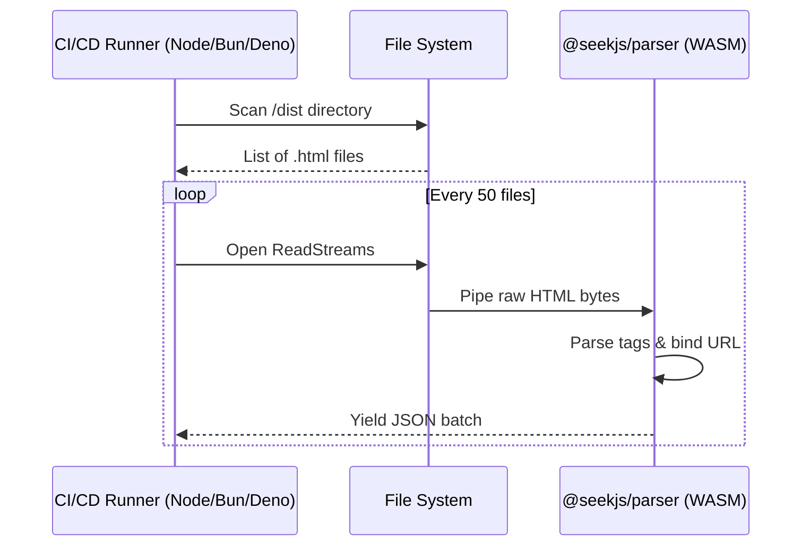
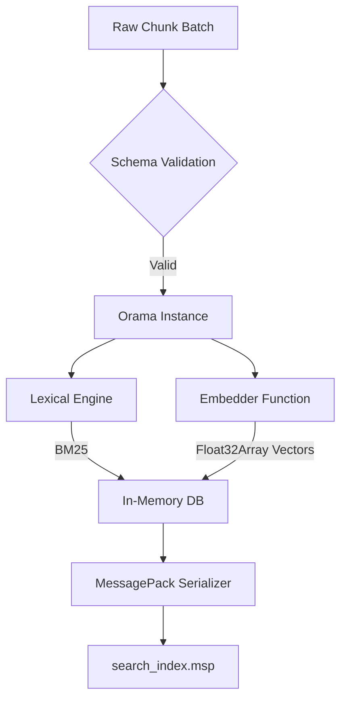
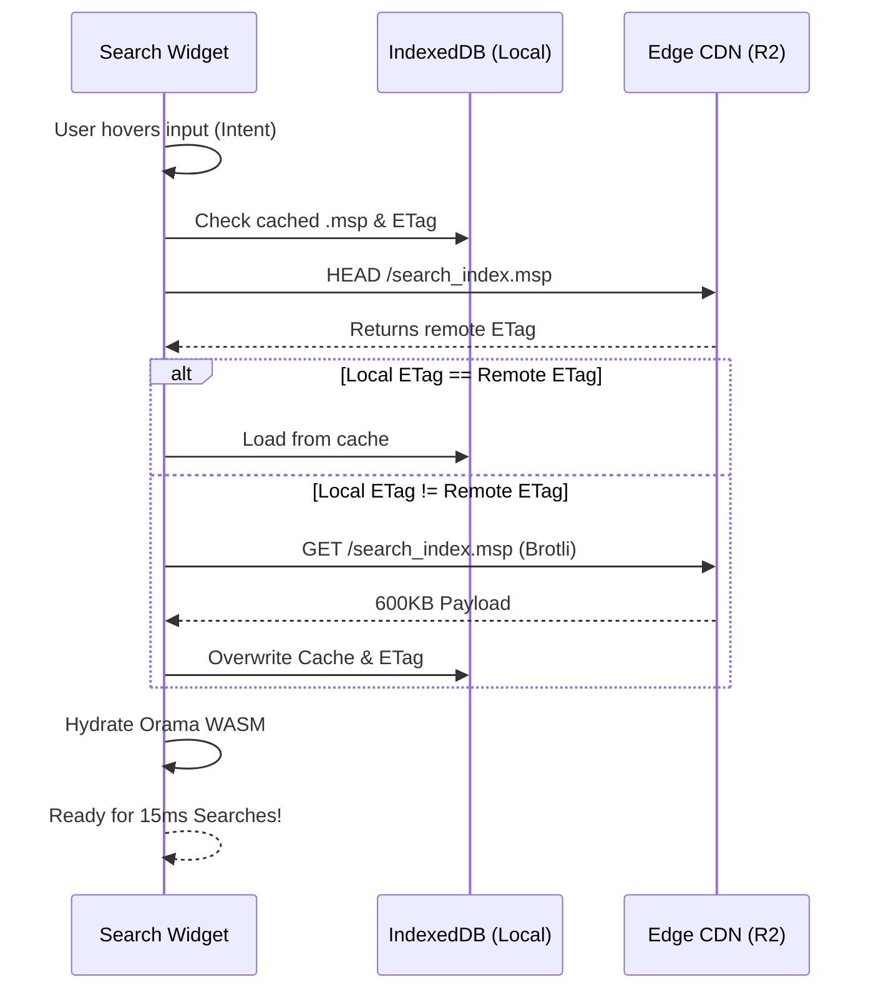
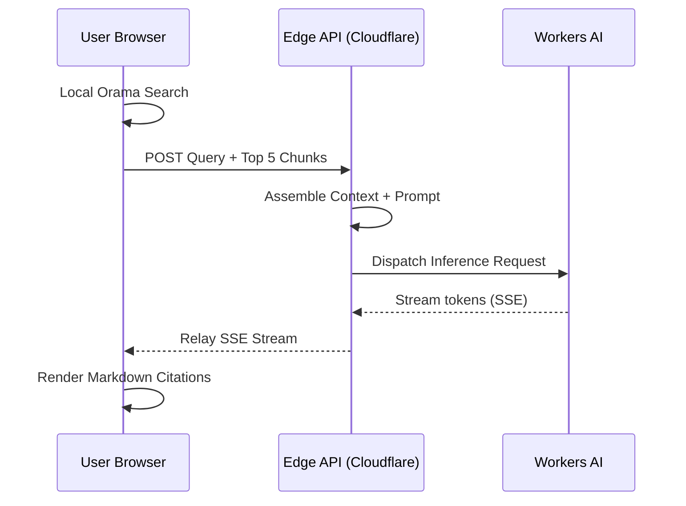

# Modules

Seek.js is shipped as focused packages you can adopt incrementally. Together they implement the [architecture](/docs/architecture) pipeline.

## `@seekjs/parser`

**Role:** Extract semantic text from HTML and bind each chunk to a source URL (for citations and deep links).

Typical inputs: your static output directory (`./dist`), a public `urlBase`, optional CSS selectors for main content, and ignore rules for pages you do not want indexed.

## `@seekjs/compiler`

**Role:** Turn chunk batches into a compact **`.msp`** binary (MessagePack-serialized index) using your chosen embedder (for example Cloudflare Workers AI embeddings in CI).

This is where schema validation, Orama-backed lexical + vector fusion, and compression/quantization strategies (to fight index bloat) live.

## `@seekjs/client`

**Role:** Hydrate the index in the browser: preload, IndexedDB caching with ETag-aware updates, and **hybrid search** in WASM-backed engines.

Framework integrations (for example React hooks) expose `search`, `results`, and lifecycle helpers so you can build widgets that feel instant.

## `@seekjs/ai-edge`

**Role:** Stream **cited** answers from the edge given `{ query, chunks }`. Providers are pluggable; Cloudflare Workers AI is the reference path in the README.

This package is optional if you only want deterministic search—but it completes the “Ask AI” story without sending your whole corpus to a third-party chat API on every request.

---

**Install surface:** Many apps will start from a meta package such as `@seekjs/core` once published; until then, follow the README’s proposed imports per module. See [Getting Started](/docs) for a minimal example.
